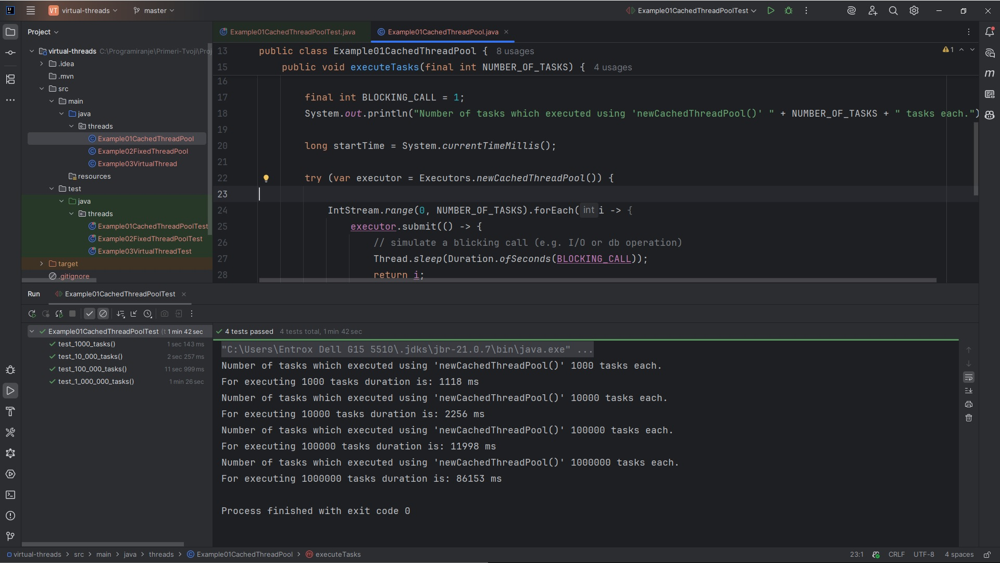
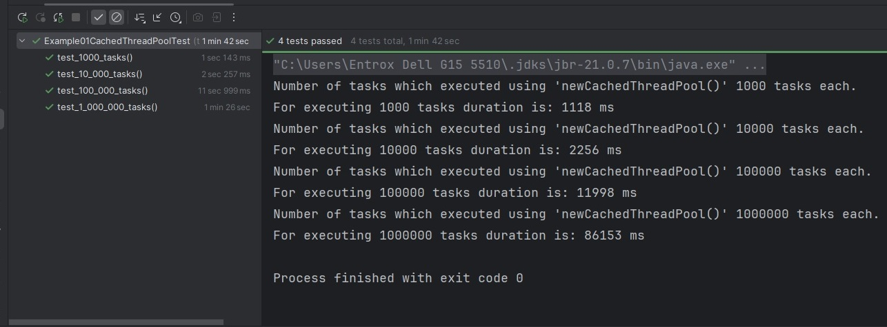
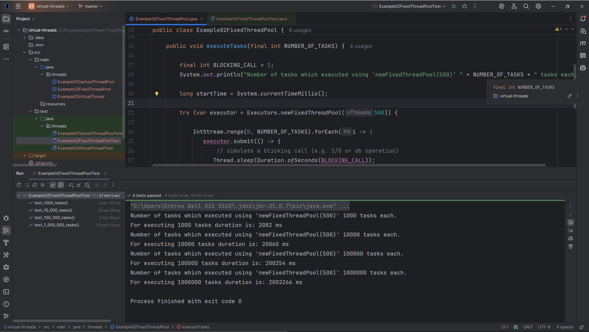
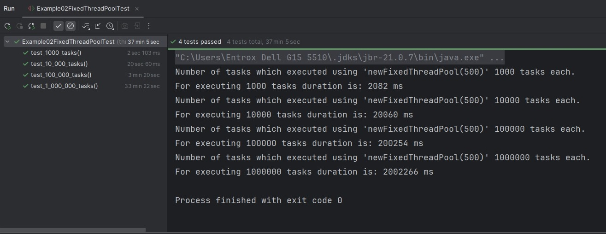
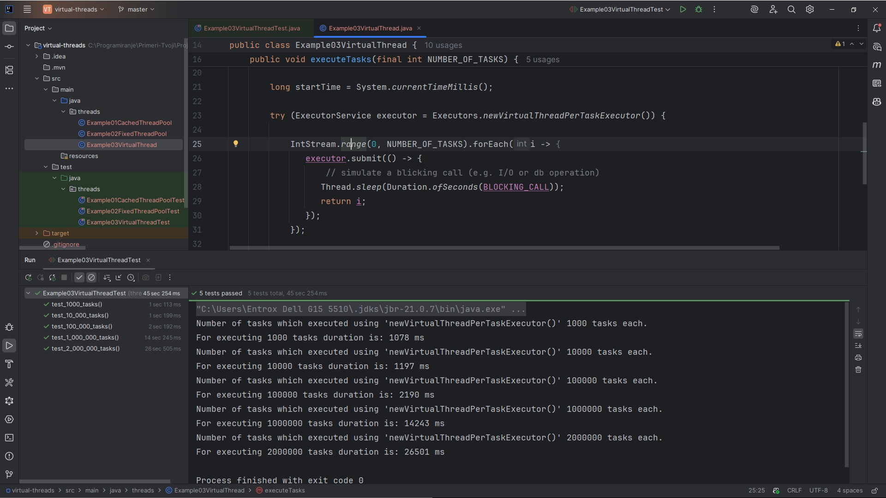
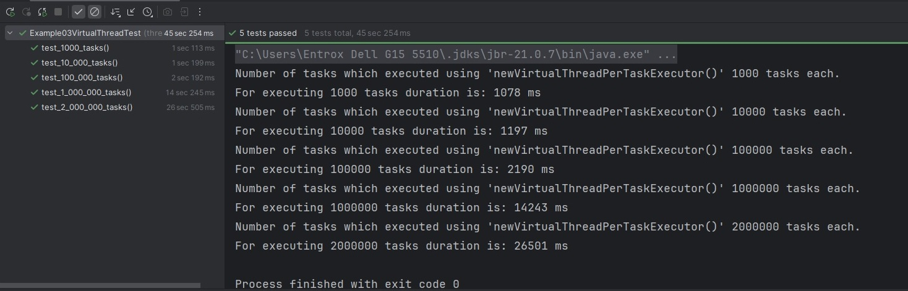
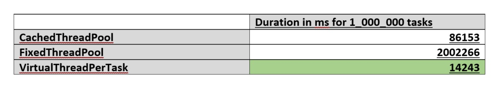

# Virtual Threads in Java 21 comparing with Cached Thread and Fixed Thread
This example demonstrates the advantage of virtual threads introduced in Java 21 over other methods of executing tasks in threads.


## Author

- **Milan Karajović**
- **email:** milan.karajovic.rs@gmail.com
- **Portfolio:** [https://milan.karajovic.rs](https://milan.karajovic.rs/)


## Tech Stack
 
- Java 21, 
- JUnit 5.1.0, 
- CachedThreadPool
- FixedThreadPool
- VirtualThreadPerTaskExecutor


 ## Documentation

 This example demonstrates the advantage of virtual threads introduced in Java 21 over other methods of executing tasks in threads. Example shows the difference in the duration of executing tasks using different strategies to create executor services. At the end it will be clear that Virtual Threads are more powerful when we have a lot of tasks to be executed.


 ## Introduction
 Starting from **Java 8**, concurrent programming is a lot of improved. Introduced two important parts of the Concurrent API: Atomic Variable and Concurrent Maps. Also, in Java 8 concurrent programming, are introduced lambda expression and functional programming.  In short line, improvements in Java 8 are: 
 
 - [Threads and Executors](https://winterbe.com/posts/2015/04/07/java8-concurrency-tutorial-thread-executor-examples/)
 - [Synchronization and Locks](https://winterbe.com/posts/2015/04/30/java8-concurrency-tutorial-synchronized-locks-examples/)
 - [Atomic Variables and ConcurrentMap](https://winterbe.com/posts/2015/05/22/java8-concurrency-tutorial-atomic-concurrent-map-examples/)
   
In **Java 21** the basic concurrence model of Java is unchanged and the Stream API is still the prefered way to process large data sets in parallel.

Using Virtual Threads, introduced in Java 21, concurrent API has better performance. Today, we have microservices architecture and server application scales, and that will cause the number of threads must grow. A main goal of virtual threads is to enable scalability of server applications written in the simple thread-per-request style.


## Virtual Threads

Before Java 21, the JDK’s current implementation of threads implements threads as thin wrappers around operating system (OS) threads. However, as OS threads are expensive:
- if each request consumes an OS thread for its duration, then the number of threads often becomes the limiting factor when attempting to scale
- thus, an application's throughput is capped even when thread pooling is employed (given that pooling does not increase the actual number of threads)

The goal is to break this 1:1 relationship between Java threads and OS threads.

Virtual thread using the idea applied in Virtual Ram memory. Illusion of plentiful memory is applied mapping a large virtual address space to limited amount of the physical RAM. Similarly, the Java runtime can give the illusion of plentiful threads by mapping a large number of virtual threads to a small number of OS threads.

**Platform threads**, implemented in the traditional way, are thin-wrapper around an OS thread.

**Virtual threads** are not tied to any particular OS thread. A virtual thread can run any code that a platform thread can run. It is good, because existing Java code that processes requests will easily run in a virtual thread. Virtual threads exist on platform threads. These platform threads (“carriers”) are then scheduled by the OS as usual.

For example, executor with Virtual thread you can create for example:

```java
ExecutorService executor = Executors.newVirtualThreadPerTaskExecutor();
```


## Example with comparison

Virtual threads only consume OS threads while performing calculations on the CPU. A virtual thread can be mounted/unmounted on different carriers over the course of its lifetime. Typically, a virtual thread will unmount when it blocks (e.g. an I/O or database operation). When the blocking operation is completed, the virtual thread is mounted on any available carrier. The mounting and unmounting of virtual threads happens frequently and transparently without blocking any OS threads.


Example – Source code

- Example01CachedThreadPool.java

  Executor is created using Cached Thread Pool:

```java
var executor = Executors.newCachedThreadPool()
```

Test results on my PC:





- Example02FixedThreadPool.java

  Executor is created using Fixed Thread Pool:

```java
var executor = Executors.newFixedThreadPool(500)
```

Test results on my PC:





- Example03VirtualThread.java

 Executor is created using Virtual Thread  Per Task Executor:

 ```java
var executor = Executors.newVirtualThreadPerTaskExecutor()
```

Test results on my PC:






## Conclusion

You see clear difference between the **duration time in ms** which different implementation of the executor spent to process all NUMBER_OF_TASKS. Also, you can experiment with different values for NUMBER_OF_TASKS. **We can see clear difference when we have big value for the NUMBER_OF_TASKS, how faster virtual threads process big value of the number of the tasks.**

The difference is very obvious when we have 1_000_000 tasks. It is shown in the table below:



**I am sure, after this clarification, if your application process a lot of tasks using concurrent API, you will definitely move on Java 21 and start to use virtual threads, which will in many ways improve performance of your application.**

## Support

- **Milan Karajović**
- **email:** milan.karajovic.rs@gmail.com
- **Portfolio:** [https://milan.karajovic.rs](https://milan.karajovic.rs/)
- **LinkedIn:** [https://www.linkedin.com/in/milan-karajovic-java-angular-security-cloud-architect/](https://www.linkedin.com/in/milan-karajovic-java-angular-security-cloud-architect/)
